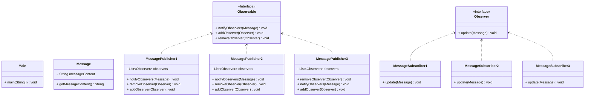

```mermaid

classDiagram
direction BT
class Main {
  + main(String[]) void
}
class Message {
  ~ String messageContent
  + getMessageContent() String
}
class MessagePublisher1 {
  - List~Observer~ observers
  + notifyObservers(Message) void
  + removeObserver(Observer) void
  + addObserver(Observer) void
}
class MessagePublisher2 {
  - List~Observer~ observers
  + notifyObservers(Message) void
  + removeObserver(Observer) void
  + addObserver(Observer) void
}
class MessagePublisher3 {
  - List~Observer~ observers
  + removeObserver(Observer) void
  + notifyObservers(Message) void
  + addObserver(Observer) void
}
class MessageSubscriber1 {
  + update(Message) void
}
class MessageSubscriber2 {
  + update(Message) void
}
class MessageSubscriber3 {
  + update(Message) void
}
class Observable {
<<Interface>>
  + notifyObservers(Message) void
  + addObserver(Observer) void
  + removeObserver(Observer) void
}
class Observer {
<<Interface>>
  + update(Message) void
}

MessagePublisher1  ..>  Observable 
MessagePublisher2  ..>  Observable 
MessagePublisher3  ..>  Observable 
MessageSubscriber1  ..>  Observer 
MessageSubscriber2  ..>  Observer 
MessageSubscriber3  ..>  Observer 

```